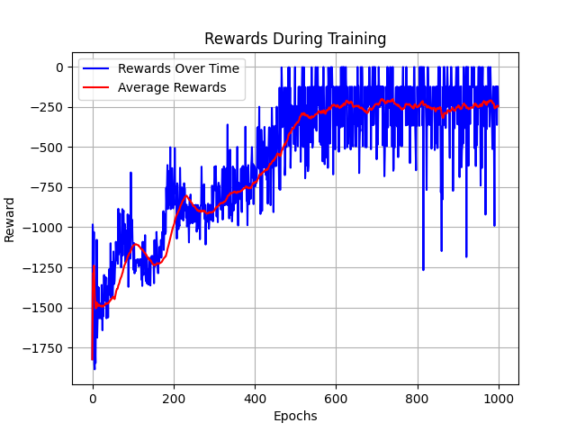
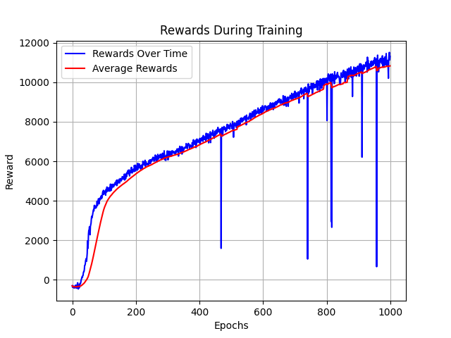

# Soft Actor-Critic (SAC) Implementation

This project is an implementation of the Soft Actor-Critic (SAC) algorithm in PyTorch for continuous control tasks in reinforcement learning.

## Project Structure

```
.
├── Architecture.py             # Defines the Actor and Critic neural network architectures
├── HalfCheetah/                # Experiment results for the HalfCheetah environment
│   ├── HalfCheetah.pt          # Trained model for HalfCheetah
│   ├── ...                     # Graphs, logs, and hyperparameters
├── Pendulum/                   # Experiment results for the Pendulum environment
│   ├── Pendulum.pt             # Trained model for Pendulum
│   ├── ...                     # Graphs, logs, and hyperparameters
├── hyperparameters.yml         # Template for hyperparameters
├── requirements.txt            # Python dependencies
├── SAC.py                      # Main script for training the SAC agent
└── test.py                     # Script for testing a trained agent
```

## Getting Started

### Prerequisites

- Python 3.8+

### Installation

1.  Clone the repository:
    ```bash
    git clone <repository-url>
    cd <repository-directory>
    ```

2.  Create a virtual environment (recommended):
    ```bash
    python3 -m venv myenv
    source myenv/bin/activate
    ```

3.  Install the required packages:
    ```bash
    pip install -r requirements.txt
    ```

## Usage

### Training

To train a new agent, you need to provide a `hyperparameters.yml` file for the environment you want to use. You can use the `hyperparameters.yml` in the root directory as a template.

Place the configured `hyperparameters.yml` file in a directory for your experiment (e.g., `MyExperiment/hyperparameters.yml`). Then, run the training script:

```bash
python SAC.py MyExperiment
```

The script will save the trained model (`.pt` file), training logs (`.csv` files), and performance graphs (`.png` files) in the `MyExperiment` directory.

For example, to train an agent for the Pendulum environment, you can use the provided configuration:

```bash
python SAC.py Pendulum
```

### Testing

To test a trained agent, you can use the `test.py` script. You need to provide the path to the experiment directory containing the trained model and hyperparameters file.

```bash
python test.py Pendulum
```

This will run the tests, print a summary of the results to the console, save the raw data to `TrainingData.csv`, the summary to `TrainingDataSummary.txt`, and record a video of the agent's performance.

## Hyperparameters

The hyperparameters for each experiment are defined in a `hyperparameters.yml` file. Here is an example from the `Pendulum` experiment:

```yaml
ENV_NAME: "Pendulum-v1"

ACTOR_HIDDEN_LAYERS: [64]
CRITIC_HIDDEN_LAYERS: [64]

ACTOR_LR:  3e-4
CRITIC_LR: 3e-4
ALPHA_LR: 3e-4

GAMMA:  0.99
TAU:  0.001
TARGET_ALPHA: 1

STD_CLAMP_MIN: -5
STD_CLAMP_MAX: 2

NUM_EPOCHS:  1000
BATCH_SIZE:  64
TRAINING_START_STEP:  1000
EXPERIENCE_REPLAY_LENGTH:  300000

LOGGINIG_FREQUECY:  10
SLIDING_WINDOW_SIZE:  50

FILE_NAME:  './Pendulum/Pendulum'

NUM_TESTS:  100
```

## Results

The training process generates reward and loss graphs, which are saved in the experiment directory.

**Pendulum Rewards:**


**HalfCheetah Rewards:**


## Contributing

Pull requests are welcome. For major changes, please open an issue first to discuss what you would like to change.
